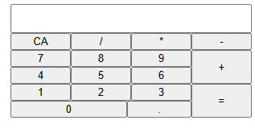

# Calculator 🧮

A simple calculator built with HTML, CSS, and JavaScript as part of **The Odin Project Foundations Course**.

---

## Features

- Basic operations: +, -, *, /
- Button and keyboard input support
- Clear/reset button

---

## Preview

https://arturocab.github.io/calculator/
---

## Built With

- HTML
- CSS
- JavaScript (Vanilla)

---

## Notes / Future Improvements

- Improve decimal handling
- Add button animations
- Add backspace support

---

## Project Link

This project is part of:

https://www.theodinproject.com/
